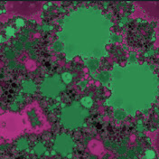

# CalcmasterFractalDll.dll Documentation
2024-10-25

Thank you Alex Pomeranz, for teaching me how to program in C++ in a month at learncpp.com.



Check out some of my fractal animation videos on YouTube: [@fractalsnakes840](https://www.youtube.com/@fractalsnakes840)

## What is this?

*Hmmm... fractals, and the need for speed...*

It's a Visual Studio 2022 C++ project that creates a dynamic link library file, *CalcmasterFractalDll.dll*, that is used to accelerate the computation of iterations for the pixels of a fractal or its julia sets using NVIDIA Compute level 7.5 (Turing architecture, e.g. GeForce GTX 1650) or higher, video card GPUs.

The C# CalcmasterFractal project uses this DLL to produce a series of julia *(or modified julia)* set bitmap image files that can be put together to form an animated video using, for example, [ffmpeg](https://ffmpeg.org/).

## Prerequisites for building the project

This Visual Studio 2022 C++ project requires instalation of the [CUDA Toolkit version 12.6](https://developer.nvidia.com/cuda-toolkit) which provides the header files that are needed to compile the code.

You also have to install the Visual Studio 2022 "Desktop development with C++" workload via the menu, Tools &gt; Get tools and features...

Note:  The output folder is set to create the dll file in the lib subdirectory of the CalcmasterFractal C# project's build output folder: CalmasterFractal\\bin\\(Debug or Release)\net8.0-windows\lib

## Interface Methods

### void* InstantiateFractalGenerator()
Calls the constructor and returns a pointer to a new instance of the **FractalGenerator** class.  Be sure to call *GetLastErrorCode()* after instantiating
the class.  The value returned by *GetLastErrorCode()* should be 0 if everything went OK.  The default type of fractal is the Mandelbrot.

```
extern "C" _declspec(dllexport) void* InstantiateFractalGenerator()

Possible GetLastErrorCode() codes:
1:  Error locating or loading fractals.json file.
    The fractals.json file should be in the same folder as the CalcmasterFractal.exe file
2:  Error parsing the fractals.json file into a valid JSON Document.
    Are you missing any punctuation or brackets in your fractals.json file?
```

### int GetLastErrorCode()
Used to get an integer value corresponding to the last error code generated
after instantiating an instance of the FractalGenerator class or after calling any of the other interface methods.

```
extern "C" _declspec(dllexport) int GetLastErrorCode(FractalGenerator* t)

If everything went OK, the value returned will be 0.
```

### void SetDimensions(FractalGenerator* t, int height, int width)
Used to inform the FractalGenerator class instance that the desired "image size" is height x width pixels.
This function does not need to be called after *InstantiateFractalGenerator()* if the desired image size is height=1080 x width=1920 pixels. Those are the default dimensions that are set during the instantiation of the class.
```
extern "C" _declspec(dllexport) void SetDimensions(FractalGenerator* t, int height, int width)

Possible GetLastErrorCode() codes:
3: Error in setDimensions(height, width). Either height or width is a value <= 0.
```