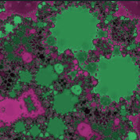

# CalcmasterFractal

CalcmasterFractal is a CUDA GPU-accelerated fractal and julia set generator with a Windows User Interface.

The IDE used to create the project is Visual Studio Community 2022.

The Windows user interface project, located in the the CalcmasterFractal folder, is written in C# using .NET 8 LTS.

The other project in the CalcmasterFractalDll folder is the engine which calculates the iterations array.  It's written in C++20 and requires installation of CUDA Toolkit 12.6.  It compiles (using nvcc) to a dll file which is loaded by the C# Windows UI at runtime.  New fractal formulas can be added easily by creating a new \_\_device\_\_ frmFormulaName function in TheCalcmaster.cu and adding the parameters for the formula to the fractals.json file.

My original project which was used to generate a bitmap file series was written completely in C# and parallel processing was performed using CPU cores.  It was slow.

I've posted several [videos](https://www.youtube.com/@fractalsnakes840) on YouTube that are good examples of what this project will be capable of when I finish adding the full functionality of the original C# project to this one.

A few examples of images that can be generated by the current project are posted on the [Gallery](https://github.com/gcarriveau/CalcmasterFractal/wiki/Gallery) page in the [Wiki](https://github.com/gcarriveau/CalcmasterFractal/wiki).

___

I observe that humans and many other creatures of the earth have evolved to seek out patterns in nature, maybe because patterns are good indicators of life.  It seems that for all creatures, either life or what once was life, or what was produced by a repeatable process of life, is either food or something that promotes life.  Everything that we recognize as life, including flora, has some sort of pattern or symmetry.  Sometimes nature embraces asymmetry and there are [creatures that possess traits of asymmetry](https://www.worldatlas.com/feature/10-animals-that-are-asymmetrical.html).  Gastropods, although not completely symmetric, have a shell whose growth follows a mathematical pattern.  A flounder is symmetric when it hatches, but over time as it lays on the sea bed, its face moves to the upper side.  The living that have either learned or evolved to hide their symmetry by means of camouflage from other creatures, are those that evade being detected as food.  Humans are attracted to and see beauty in symmetry. From this, I deduct that symmetry and patterns must promote life.  Patterns are the channel through which we communicate with one another - the structure of sentences, the tones of sound, the use of symbols and tools, the level of precision in the dances of certain breeds of spiders to attract mates.  For me, fractals are food for thought, because in fractals I see patterns of symmetry and self-similarity.  I see math creating images that look like life or that appear to be explanations for the processes of nature, and that math feeds my hunger.
